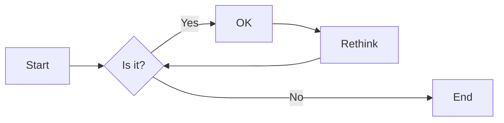

win 11 壁纸位置
C:\Windows\Web\Wallpaper

查看连接过的WiFi密码
	netsh wlan show profiles
	netsh wlan show profile name="wifiName" key = clear

重置网络
	netsh winsock reset
	这个命令是用于重置Winsock目录，以解决由于软件冲突、病毒原因造成的参数错误问题。netsh是一个能够通过命令行操作几乎所有网络相关设置的接口，比如设置IP、DNS、网卡、无线网络等，Winsock是系统内部目录，Winsock是Windows网络编程接口，winsock工作在应用层，它提供与底层传输协议无关的高层数据传输编程接口，reset是对Winsock的重置操作。

rasphone.pbk文件是Windows系统中的一个电话本文件，它包含了你计算机上所有的拨号连接信息。这个文件通常存储在C:\Users\用户名\AppData\Roaming\Microsoft\Network\Connections\Pbk目录下。如果你想编辑或删除某个拨号连接，可以使用这个文件。
	privado 和 pjvpn 会保存到这个文件,其他的没保存过,不知道原因...
	rasphone.pbk是Windows系统自带的VPN客户端使用的文件。
	这个客户端支持IKEv2协议

文件管理器 复制一份出来的快捷键   Ctrl+N

![[Pasted image 20230504140135.png]]
	mark一下

![[Pasted image 20230512090700.png]]

网络问题
![[Pasted image 20230526180146.png]]
![[03983a7fbd908528cda401c3c0573ef.png]]
